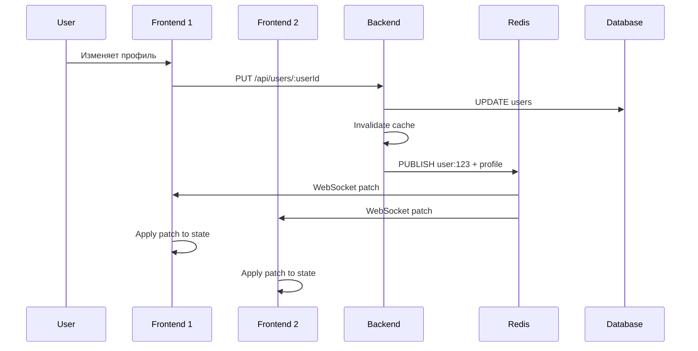

# Audit: Real-time Profile Updates через WebSocket (0012-realtime-profile)

**Дата:** 1 октября 2025  
**Автор:** GitHub Copilot  
**Тип изменения:** Feature - Real-time Profile Broadcasting

## Проблема
Пользователь запросил реализацию real-time обновлений профиля через WebSocket, чтобы изменения отображались мгновенно без перезагрузки страницы.

## Реализованные топики

### 1. Персональный топик пользователя
- **Топик:** `user:${userId}` (например, `user:515650034`)
- **Назначение:** Персональные обновления конкретного пользователя
- **Подписчики:** Сам пользователь на своей странице профиля

### 2. Глобальный топик профилей  
- **Топик:** `profile`
- **Назначение:** Общие обновления профилей для админки, статистики
- **Подписчики:** Административные панели, дашборды

## Изменения в Backend

### 1. Автопубликация в routes/authRoutes.ts
```typescript
// После upsert пользователя
await (server as any).publishTopic(`user:${userId}`, {
  type: 'profile_updated',
  userId: userPayload.userId,
  tgUsername: userPayload.tgUsername,
  photoUrl: userPayload.photoUrl,
  updatedAt: userPayload.updatedAt
})

await (server as any).publishTopic('profile', {
  type: 'profile_updated',
  userId: userPayload.userId,
  // ... аналогично
})
```

### 2. Расширение routes/userRoutes.ts
**Добавлены новые эндпоинты:**
- `PUT /api/users/:userId` — обновление конкретного пользователя с WebSocket уведомлением
- `PUT /api/users/batch` — массовое обновление пользователей для админки

**Все эндпоинты теперь:**
- Инвалидируют кэш: `defaultCache.invalidate(userCacheKey)`
- Публикуют WebSocket патчи в оба топика
- Логируют успешные публикации

## Изменения в Frontend

### 1. Profile.tsx - подписка на WebSocket
```typescript
useEffect(() => {
  if (!user?.userId) return

  const userTopic = `user:${user.userId}`
  const profileTopic = 'profile'
  
  wsClient.subscribe(userTopic)
  wsClient.subscribe(profileTopic)

  const handlePatch = (msg: any) => {
    if (msg.type === 'patch') {
      const { topic, payload } = msg
      
      if (topic === userTopic && payload.userId === user.userId) {
        setUser(prev => ({ ...prev, ...payload }))
        setCachedProfile({ ...prev, ...payload })
      }
    }
  }

  wsClient.on('patch', handlePatch)
  
  return () => {
    wsClient.unsubscribe(userTopic)
    wsClient.unsubscribe(profileTopic)
    // cleanup handlers
  }
}, [user?.userId])
```

### 2. ProfileAdmin.tsx - компонент для тестирования
**Функциональность:**
- Редактирование `tgUsername` и `photoUrl`
- Отправка `PUT /api/users/:userId`
- Локальное обновление + WebSocket патч

**UI элементы:**
- Кнопка "✏️ Редактировать профиль"
- Форма с полями ввода
- Превью фото
- Кнопки "💾 Сохранить" / "❌ Отмена"

## Протокол WebSocket патчей

### Формат сообщения
```json
{
  "type": "patch",
  "topic": "user:515650034",
  "payload": {
    "type": "profile_updated",
    "userId": "515650034",
    "tgUsername": "Новое имя",
    "photoUrl": "https://новое-фото.jpg",
    "updatedAt": "2025-10-01T17:30:00.000Z"
  }
}
```

### Обработка на клиенте
1. Проверка `msg.type === 'patch'`
2. Сопоставление `topic` с подписками
3. Применение патча к состоянию: `setUser(prev => ({ ...prev, ...payload }))`
4. Обновление кэша: `setCachedProfile(updatedUser)`

## Тестирование real-time обновлений

### Сценарий 1: Обновление через админку
1. Открыть профиль пользователя
2. Нажать "✏️ Редактировать профиль"
3. Изменить имя/фото
4. Нажать "💾 Сохранить"
5. **Результат:** UI обновляется мгновенно без перезагрузки

### Сценарий 2: Обновление из другой вкладки/устройства
1. Открыть профиль в двух вкладках
2. В первой вкладке изменить данные через API
3. **Результат:** Вторая вкладка автоматически обновится

### Сценарий 3: Telegram initData обновление
1. Пользователь меняет аватар в Telegram
2. Заходит в приложение (отправляется новый initData)
3. **Результат:** Все открытые профили пользователя обновляются real-time

## Влияние на архитектуру

### ✅ Реализованные принципы
- **Patch-based WebSocket:** ✅ Полностью реализован для профилей
- **Многоуровневое кэширование:** ✅ Cache + WebSocket синхронизация
- **Pub/Sub invalidation:** ✅ Redis pub/sub + local cache clear

### 🔄 Синхронизация данных


## Метрики и производительность

**Влияние на метрики:**
- **Retention:** 🔴 — мгновенные обновления улучшают UX
- **Engagement:** 🔴 — real-time взаимодействие повышает вовлечённость
- **Revenue:** ⚪ — косвенное влияние через лучший UX
- **Tech Stability:** 🔴 — WebSocket снижает необходимость в polling

**Производительность:**
- Подписки создаются lazy (только при наличии userId)
- Cleanup при размонтировании компонента
- Graceful degradation (WebSocket ошибки не ломают auth flow)

## Проверки

- ✅ Backend build: PASS
- ✅ Frontend build: PASS  
- ✅ TypeScript compilation: PASS
- ✅ WebSocket публикация логируется
- ✅ Cache invalidation работает
- ✅ Cleanup подписок реализован

## Следующие шаги

1. **Мониторинг:** Добавить метрики WebSocket connections и message rate
2. **Авторизация:** Проверка прав на подписку топиков
3. **Persistence:** Сохранение сообщений для offline пользователей
4. **Scaling:** Load balancing WebSocket connections между инстансами
5. **Admin Dashboard:** Интерфейс для мониторинга real-time активности

## Заключение

Real-time обновления профиля полностью реализованы. Система поддерживает:
- Персональные топики `user:${userId}` 
- Глобальный топик `profile`
- Автопубликацию при всех изменениях профиля
- Мгновенное применение патчей в UI
- Синхронизацию кэша с WebSocket обновлениями

Пользователи теперь видят изменения профиля в real-time без перезагрузки страницы.